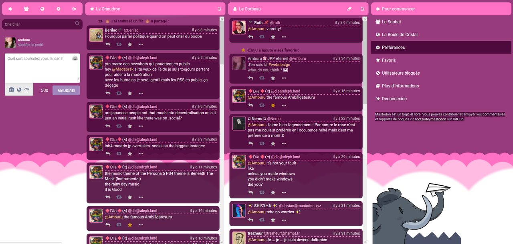
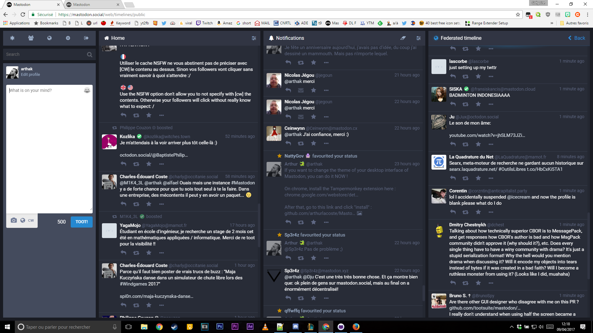

# Mastodon Cloud Theme

Mastodon Cloud Theme is a library of hacks for Mastodon desktop interface.

You can change the fit of the columns, or resize the pics thumbnails.

[Know more about Mastodon.](https://github.com/tootsuite/mastodon)

# Demo of Clear Theme

This is a simple Greasmonkey script allow you to change the default theme "tweetdeck-like" into another clear and beautiful theme.

# Demo of Cute Witches

This is a pink girly theme from @amburu-hime, alias [@amburu](https://witches.town/@Amburu) on Mastodon.

# Demo of Flex Columns

Flex Columns fit the columns to the screen.

# Install

On chrome, install the Tampermonkey extension here :
https://chrome.google.com/webstore/detail/tampermonkey/dhdgffkkebhmkfjojejmpbldmpobfkfo?hl=fr

After that, go to a script file, click on the "raw" button and click "install".