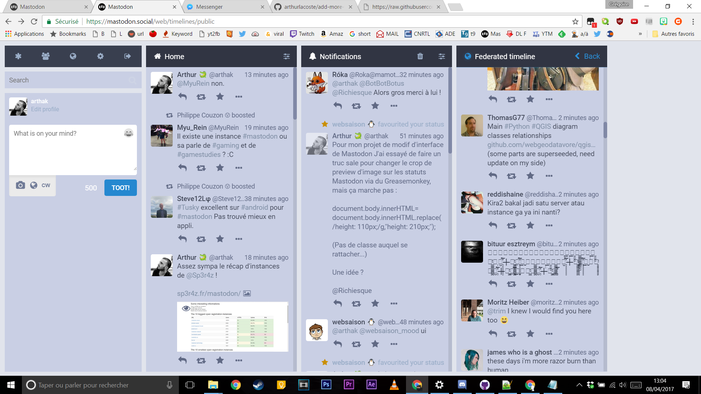

# Mastodon Cloud Theme

Mastodon Cloud Theme is a library of hacks for Mastodon desktop interface.

You can change the fit of the colomns, or resize the pics thumbnails.

# Demo of Clear Theme

This is a simple Greasmonkey script allow you to change the default theme "tweetdeck-like" into another clear and beautiful theme.

# Install

On chrome, install the Tampermonkey extension here :
https://chrome.google.com/webstore/detail/tampermonkey/dhdgffkkebhmkfjojejmpbldmpobfkfo?hl=fr

After that, go to a script file, click on the "raw" button and click "install".